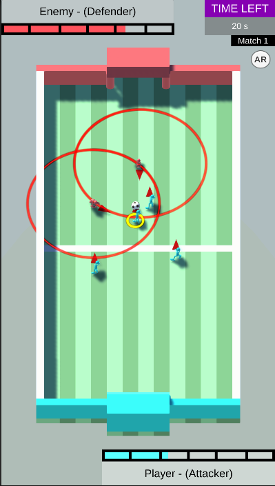
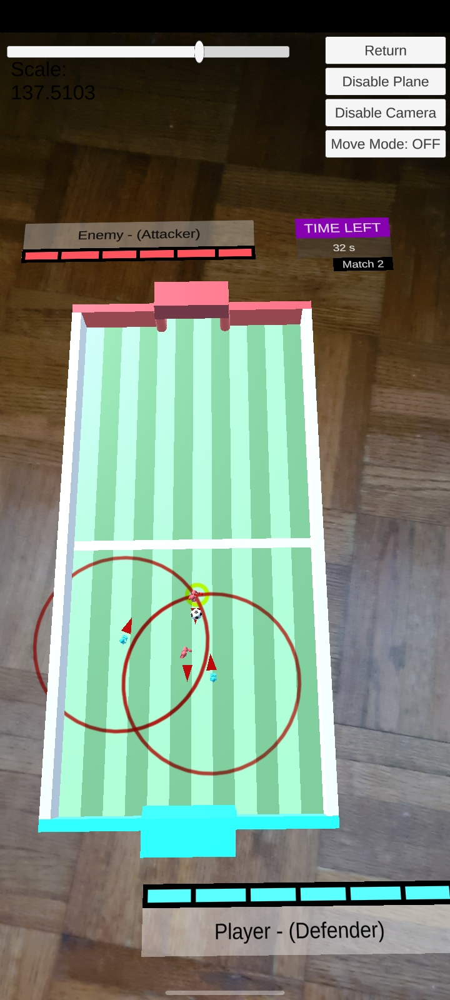

# Pratical Test

This game was created within 4 days so the code is not all pretty especially the for AR and GameManager code

## Tasks:
Completed:
- Gameplay
- AR Mode
- Bonus (using models, particle effects, menu system, AR shadow and URP)

Incompleted:
- Animations for some few scenarios
- Penalty map
- Other Bonus

Noticed Bugs:
- Some soldiers bugged out when there are too many on the field
- When reset AR scene every match the ball game location got reset

## ScreenShots
&nbsp;&nbsp;&nbsp;&nbsp;
